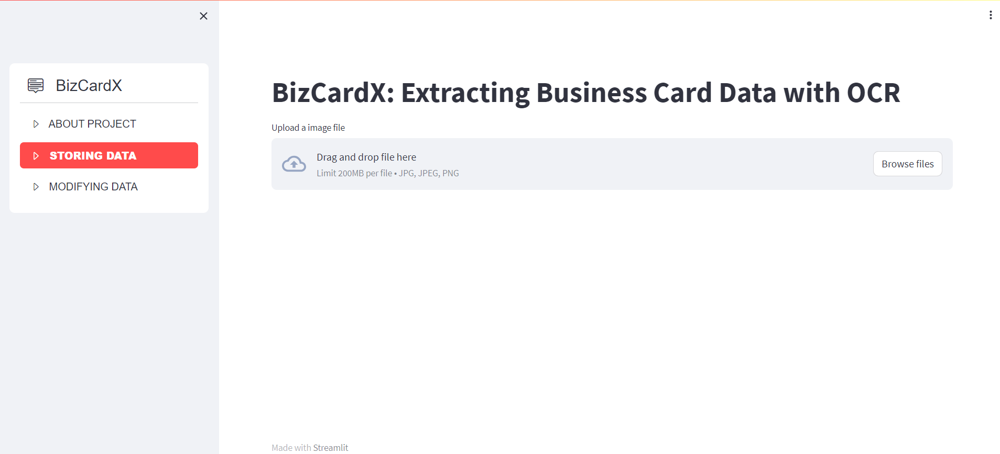

# BizCardX-Extracting_Business_Card_Data_with_OCR



## Project Overview
 
   BizCardX is a user-friendly tool for extracting information from business cards. The tool uses OCR technology to recognize text on business cards and extracts the data into a SQL database after classification using regular expressions. Users can access the extracted information using a GUI built using streamlit.
   The BizCardX application is a simple and intuitive user interface that guides users through the process of uploading the business card image and extracting its information. The extracted information would be displayed in a clean and organized manner, and users would be able to easily add it to the database with the click of a button. Further the data stored in database can be easily Read, updated and deleted by user as per the requirement.

## Features

1. **Data Extraction**: Users can conveniently upload business card images, and the application employs easyOCR for automatic extraction.
2. **Data Storage**: The application seamlessly integrates with a database management system. Users have the capability to save both the uploaded business card images and the extracted information into the database.
3. **User-Friendly Interface**: Extracted information is presented in a well-organized manner within the interface. Streamlit's widgets facilitate ease of use, and a simple button click enables data storage in the database.
4. **Data Modification**:  Implemented the ability for users to delete a specific business card entry from the database.

## Libraries/Modules used for the project!

   - Pandas - (To Create a DataFrame with the scraped data)
   - mysql.connector - (To store and retrieve the data)
   - Streamlit - (To Create Graphical user Interface)
   - EasyOCR - (To extract text from images)
   
## Getting Started

1. Clone this repository to your local machine.
2. Install the required dependencies using the below command.
```bash
pip install streamlit
pip install streamlit-option-menu
pip install mysql-connector-python
pip install regex
pip install numpy
pip install easyocr
pip install Pillow
```
5. Configure the MYSQL connection by replacing the existing password in **sql.py** file with your MYSQL password. 
6. Run the Streamlit app using the below command.
   
```bash
streamlit run main.py
```

## Usage
1. Upload the Business card image containing the data you wish to extract.
2. After confirming the accuracy of the extracted information, simply click the *Upload* button to save the data into the database.
3. Additionally, you have the option to select specific data entries for either modification or deletion.

## Contributions
Contributions to this project are welcome! If you encounter any issues or have suggestions for improvements, feel free to submit a pull request.

## Contact
For inquiries or support, please contact balajigurusamy99@gmail.com or 
[LINKEDIN](https://www.linkedin.com/in/balajiguru/)
